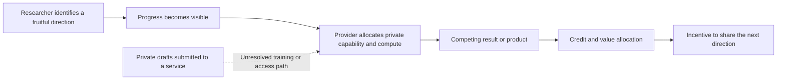

# Navier–Stokes, research credit, customer data and the AI value chain

**As of:** 2026-09-10. **Status:** DRAFT. **Analyst:** Codex / GPT-6. **Source set:** 23 source analyses, including every supplied URL, the complete recovered Tao and Thom threads, three additional news reports, two additional OpenAI researcher responses, and official API policy. Technical papers, screenshots and archive versions are supporting artifacts.

> **Types:** `[F]` fact or explicitly attributed statement; `[T]` theory; `[H]` hypothesis; `[P]` prediction. **Evidence:** E3 expert/preprint; E4 reporting/industry documents; E5 firsthand account/opinion; E6 unsupported inference. **Verification:** `ok` established at the specified scope; `x` refuted; `nf` searched but not established; `blocked` inaccessible; `?` unattempted. Confidence that a person made a statement is separate from confidence that their allegation is true.

The record supports a narrower and more consequential conclusion than either “OpenAI stole the proof” or “nothing happened because the proofs differ.” OpenAI acknowledges that rumors triggered a major competing research effort. Both sides describe a proposed rewrite with a special role for Buckmaster and an obstacle to Alpöge’s participation based on his Anthropic employment. Bubeck acknowledges the career remark and apologizes. An archived early bibliography omits relevant Córdoba–Martínez-Zoroa work that a later version adds. Direct access to customer drafts is denied; training influence is explicitly left unresolved. No recovered source supplies an independent data-lineage audit or a completed institutional finding of plagiarism or fraud.

For the [July value-chain essay](../sources/lhl-2026-ai-value-chain.md), the strongest update is to the competition mechanism: **the valuable input can be the signal that a problem is tractable, even before the provider obtains the solution or any confidential draft.** A private capability and compute advantage can convert that signal into rapid competing work. This case makes that mechanism concrete, but does not show that every customer business can be displaced as quickly as a mathematical proof can be produced.

## 1. What each side actually proved or claimed

| Work | Published claim | What this pass establishes |
|---|---|---|
| Alpöge–Buckmaster | Blowup with smooth forcing for incompressible porous media, Boussinesq and 3D incompressible Euler | Initial statement and Euler paper explicitly say **forced**. They credit Córdoba and Martínez-Zoroa’s program. August 15 results and August 22 Lean verification are participant-reported dates. |
| Their hypodissipative Navier–Stokes work | A result they believed they had, with Lean verification unfinished and no presentable writeup in the initial statement | It was not released with the initial three papers. Its contents cannot be reconstructed from later allegations of resemblance. |
| OpenAI’s intermediate Euler work | **Unforced** Euler blowup | Company account; not the same statement as the pair’s released forced Euler result. |
| OpenAI Navier–Stokes paper | Positive-viscosity, smooth-forced blowup with bounded energy and unbounded velocity; claimed Clay alternatives C and D | Theorem 1.1 and Corollary 10.6 are inspectable claims. The Clay statement allows forced counterexamples. This pass does not certify the proof or its Lean encoding. |

Sources: [OpenAI release analysis](../sources/openai-2026-navier-stokes-solution.md), [Buckmaster statement analysis](../sources/buckmaster-2026-navier-stokes-statement.md), [Euler paper](../../reference/captured/navier-stokes-2026/euler-pdf.pdf), [OpenAI paper](../../reference/captured/navier-stokes-2026/openai-proof-pdf.pdf), [Clay formulation](../../reference/captured/navier-stokes-2026/clay-pdf.pdf). Claims TECH-2026-301, INST-2026-301.

A different or stronger theorem is evidence against a simple claim of verbatim duplication. It is not sufficient evidence of independent intellectual origin: a stronger theorem can build on a weaker result or on an unpublished ansatz. Conversely, working in the same broad public program does not demonstrate plagiarism. Relevant distinctions include copied text, reused ideas, access to a draft, influence through model training, information about promising directions, and independent rediscovery.

## 2. Chronology, with attribution and time zones

| Date | Event | Evidentiary status |
|---|---|---|
| August 15 | Buckmaster and Alpöge say they obtained the forced Boussinesq and Euler results. | Participant account; published Euler statement is available, original discovery timestamp unaudited. |
| August 22 | They report Lean verification. | Participant account; no clean-room build performed here. |
| August 28 | OpenAI says training began on the internal model used for the effort, and that training continued. | Company disclosure. Starting training is not proof of using any particular later example. |
| September 1 | OpenAI says rumors of two solved Millennium problems led it to evaluate its model on the open Millennium problems and other targets. | Admitted by OpenAI, Bubeck and Altman. |
| September 2 | Alpöge says he contacted OpenAI, stressing a personal collaboration and use of both Claude and Codex. | Bubeck acknowledges Wednesday contact; message contents are Alpöge’s account. |
| September 3 | Buckmaster says he emailed an OpenAI mathematician to clarify the rumors and the collaboration’s independence. | Email quoted in full in his statement; no original message file inspected. |
| September 5 | OpenAI says agents reached the Navier–Stokes result after about 88 hours. | Company telemetry claim. |
| September 6 | OpenAI reports completion of another 17 hours of Lean work. Buckmaster and Bubeck describe calls about publication, credit and a rewrite. | Broad discussion and career remark corroborated across participants; intent and precise terms disputed. |
| September 7 late evening New York / September 8 03:58 UTC | Buckmaster announces the three papers and his statement. | Public Mastodon timestamp. This precedes the OpenAI announcement; “Monday” and “Tuesday” accounts can both refer to this event. |
| September 8 | OpenAI announces its candidate solution and publishes its data-access denial and training caveat. Bubeck and Altman respond. | Public records captured. |
| September 8, 17:29:48 UTC archive | OpenAI PDF has 16 bibliography entries without Córdoba–Martínez-Zoroa. | Independently captured PDF. |
| September 8, 20:04:49 UTC archive | PDF has 22 entries, adding those authors and a historical discussion. | Independently captured PDF; byte-identical to September 10 download. The capture interval is not an exact edit timestamp. |
| September 8, later posts | Buckmaster alleges “absolute academic malpractice”; Alpöge says another unpublished approach resembles OpenAI’s proof. | Stronger statements than the initial PDF’s explicit uncertainty; underlying data use remains unproved. |
| September 8–9 | Tao publishes four posts on problem selection and sharing; Thom publishes three posts describing an earlier transparency dispute. | Complete author threads recovered through APIs. |
| September 9–10 | Additional reporting in The Decoder, El País and ABC. | Adds links and named interviews; much chronology still derives from the same primary statements. |

## 3. Misconduct claims: what the evidence does and does not establish

| Issue | Supporting record | Response / limitation | Assessment |
|---|---|---|---|
| Racing researchers after learning of progress | OpenAI, Bubeck and Altman acknowledge the rumor trigger; the release describes reassignment of agents and a large private-model effort. | They say the initial rumor suggested an Anthropic institutional result and that they independently explored multiple problems. | **Well-supported competitive response.** It does not establish that a private draft supplied the research direction. INST-2026-300. |
| Direct access to customer drafts or chats | Buckmaster asks about Codex drafts; timing and broad approach raise suspicion. | OpenAI categorically denies researchers or agents saw the work before release. Brown repeats the denial. No access logs independently audited. | **Not established.** A denial is evidence of the company’s position, not a technical audit. INST-2026-312, INST-2026-338. |
| Training on their work | OpenAI cannot rule out de-identified usage helping improve models; training was ongoing. Alpöge and Buckmaster refer to other unpublished approaches. | A possible pipeline is not evidence of inclusion or causal influence. Products, opt-ins, dataset selection and checkpoints are undisclosed. | **Open, serious provenance question.** The joint hypothesis of ingestion and material contribution remains low-confidence: 0.35, E6. This subjective estimate is not a measured frequency. INST-2026-306, INST-2026-313. |
| Excluding Alpöge from authorship | Buckmaster’s account; Bubeck and Altman acknowledge an affiliation concern in the proposed rewrite. | Bubeck says he did not demand removal from Alpöge’s **own existing work**, but objected to his authoring an OpenAI-proof rewrite. | **Affiliation-based restriction is acknowledged; the broad “remove him from their paper” version is misleading.** Whether he had a contribution-based claim to the new paper depends partly on unresolved provenance. INST-2026-316, INST-2026-318. |
| Threatening Buckmaster’s career | Buckmaster quotes “Why would you ruin your career?” | Bubeck acknowledges career wording, apologizes and says it concerned unfounded accusations and was immediately retracted. | **Remark and apology established; motive and effect disputed.** The power imbalance and context support a coercion interpretation without proving intent. INST-2026-304, INST-2026-315. |
| Inadequate citation | Early archived PDF omits three relevant Córdoba/Martínez-Zoroa items; later PDF adds them and discusses the program. | Early bibliography already cited other prior work, including Buckmaster–Vicol. Later correction does not establish why the omission occurred. | **Specific omission and amendment verified.** Neither “no prior work was cited” nor “the current PDF omits those authors” is accurate. INST-2026-307. |
| Misrepresenting autonomy | Initial “very little human input” account versus disclosed team orchestration, easier problems, prompt consolidation and compute. | Bubeck distinguishes human orchestration from research-level fluid-dynamics input. | **Degree of autonomy needs an operational definition and logs.** Not a demonstrated fabricated proof. TECH-2026-302. |
| Academic fraud or plagiarism as an adjudicated finding | Critics use malpractice/plagiarism language; some reporting intensifies it. | No independent finding, complete training audit, or authenticated private manuscript comparison recovered. | **Do not present as established.** Specific citation, credit and transparency concerns can be assessed without that blanket verdict. |

The career remark is not absolved merely because its speaker reports benign intent. Similarly, calling a proposal generous does not decide whether scientific credit tracks actual contributions. A funded rewrite or editorial role can be legitimate if accurately described. A proposal becomes a different ethical problem if it asks someone to claim scientific credit they did not earn, deny another person’s contribution, or trade credit for silence. The captured record does not settle the exact proposal against all these criteria.

## 4. A verified bibliography amendment

The [screenshot attached to Buckmaster’s follow-up](../../reference/captured/navier-stokes-2026/buckmaster-screenshot.png) reproduces Gonzalo Cao-Labora’s criticism. It shows a 16-entry bibliography. That screenshot alone would leave open whether it was cropped, old or otherwise unrepresentative.

The archive supplies stronger evidence:

- [September 8 17:29:48 UTC PDF](../../reference/captured/navier-stokes-2026/openai-proof-20260908-172948.pdf), SHA-256 `8c8a94ad9ac824c8b605b9827cadf7beaca48bd10b380de3cfc872a2c37afa81`: 16 references.
- [September 8 20:04:49 UTC PDF](../../reference/captured/navier-stokes-2026/openai-proof-20260908-200449.pdf), SHA-256 `0e779481c4da40bd28d1e642e1d8ca57447d129610df28dfa5a11e9af8ae228f`: 22 references; same hash as the September 10 direct download.
- [Archive index](../../reference/captured/navier-stokes-2026/proof-archive-search.json) and [extracted-text diff](../../reference/captured/navier-stokes-2026/proof-version-diff.txt) preserve the record. Reflow makes the full text diff noisy; inspect section 1.1 and the bibliographies for the substantive attribution change.

The added entries include Córdoba and Martínez-Zoroa’s forced Euler paper, their IPM paper, and Córdoba, Martínez-Zoroa and Zheng’s hypodissipative Navier–Stokes paper. The new discussion credits scale-amplification work while explaining a claimed difference: in OpenAI’s construction, oscillatory pulses supply mean momentum flux for a collapsing background vortex. This is a claim about mathematical relationship that specialists can examine. It does not resolve whether private drafts influenced the system.

The archived change establishes version history. It does not establish the exact edit time, who made the edit, whether criticism caused it, or that the entire proof is plagiarized. Missing attribution to other researchers mentioned in the screenshot requires its own relevance assessment; adding these six entries does not automatically settle all attribution concerns.

## 5. The primary back-and-forth worth reading together

**Buckmaster’s initial statement versus his later posts.** The [initial PDF](../sources/buckmaster-2026-navier-stokes-statement.md) expressly says he does not know whether data was used. The [later posts](../sources/buckmaster-2026-training-and-malpractice-posts.md) express a stronger belief and call the episode malpractice. Reporting should preserve that evolution. Training after August 15 does not logically prove use of his August work.

**Alpöge’s two contributions.** His [September 2 contact account](../sources/alpoge-2026-september-two-contact.md) challenges the continuing institutional framing. His [September 8 response](../sources/alpoge-2026-training-authorship-response.md) says he would have welcomed collaboration and that another unpublished approach matters to the comparison. It is possible both that he declined particular calls and that he was willing to collaborate under different conditions.

**Bubeck’s screenshot and full reply.** The [reply analysis](../sources/bubeck-2026-navier-stokes-response.md) links the [image](../../reference/captured/navier-stokes-2026/bubeck-screenshot.jpg) and [visual transcription](../../reference/captured/navier-stokes-2026/bubeck-screenshot-transcription.txt). It supports an offer to share prompts and recognize priority. It does not document the entire later conversation. His authorship clarification is substantive; his acknowledgment of the career remark is also substantive.

**OpenAI’s caveat versus the capability defense.** The [official response](../sources/openai-2026-navier-stokes-data-response.md) leaves training influence open. [Brown](../sources/brown-2026-navier-stokes-access-denial.md) denies direct access, and [Barak](../sources/barak-2026-navier-stokes-hints-defense.md) says the model did not need hints. Capability and provenance can both matter: a capable model could still benefit from an example. The relevant experiment would be a controlled exclusion or ablation, not a stronger benchmark score by itself.

**Thom’s prior case.** [All three posts](../sources/thom-2026-unpublished-math-transparency.md) describe a question to Sellke and Bubeck about both training and solving-time access, followed by Sellke’s categorical answer. Thom says he opted out on June 29. That does not establish the Buckmaster accounts’ settings, nor prove Sellke’s answer was false. It does identify the missing evidence: account-specific exclusions, relevant datasets and checkpoints, and what survives de-identification. The prior exchange is testimony, not an independently authenticated email archive.

**Tao’s institutional argument.** [The four-post thread](../sources/tao-2026-promising-problems-open-science.md) concerns scarce fruitful problems and knowledge of a field’s difficulty, not running out of all possible mathematical questions. He says new tools can expand frontiers as well as flatten them. His concern is that opaque, rapid extraction and undisclosed negative results can discourage the sharing needed to cultivate the next set of questions.

## 6. How this changes the July value-chain analysis

| July mechanism | What this case adds | What remains unproved |
|---|---|---|
| Training on customer content | An explicit unresolved caveat from the provider, an ongoing training run and a dispute involving unpublished research. | Specific ingestion, material influence, unauthorized use or violation of a no-training commitment. |
| Valuable byproducts | A productive conjecture, ansatz, failed approach or feasibility signal can have value independently of the finished manuscript. | Which nonpublic artifacts, if any, entered OpenAI’s training or evaluation process. |
| Provider competition | The rumor-triggered effort is acknowledged; the provider used a private system and large compute. | That the rumor came through customer surveillance, that OpenAI intentionally targeted a particular customer from the outset, or that it can win every downstream market. |
| Customer control and exit | Owning models, research logs, evaluations and orchestration reduces exposure and dependence. | That locally controlled models match the private frontier on hard research tasks or prevent competition after public disclosure. |

A useful extension is to distinguish **knowledge of a problem’s promise** from **knowledge of its solution**. An observed research success can lower uncertainty enough to make a large competing investment attractive. Information can arrive through rumors, public talks, preprints, usage patterns or private drafts; these routes differ ethically and legally. This case documents the rumor route in OpenAI’s account. It does not establish prompt surveillance.

The main competition path can operate without the dotted path. Conversely, excluding the dotted path would not answer whether the competitive behavior damages collaboration.

Allen’s [economic scenario](../sources/allen-2026-private-model-competition.md) is a useful stress test, not a demonstrated outcome for all industries. Its exclusively-public-tools premise is incomplete: participant accounts describe internal Anthropic models too. Drug discovery, medicine and materials also require experimental validation, regulatory work, manufacturing or distribution. Mathematical success does not show that these complementary assets disappear. [Taylor-King’s pharma prediction](../sources/taylor-king-2026-drug-discovery-trust.md) should be revisited against actual policies and use over the following year.

The July essay’s distinction between enterprise no-training defaults and broader competition remains useful. The [current API policy](../sources/openai-2026-api-data-controls.md) says no training absent explicit opt-in and separately describes operational retention. It cannot establish what happened in these researchers’ accounts. Paying out of research funds is not proof of an enterprise contract, an API key, a training opt-out or zero retention.

## 7. Strongest competing interpretations

**Critics’ strongest account:** Researchers cultivate a promising direction and expose parts of their work to a supplier. The supplier learns of progress, uses a stronger private system and vastly more compute, and then negotiates credit around institutional rivalry. Opaque training and weak provenance make it hard to tell whether the researchers supplied more than a feasibility signal. Even if the final proof is independently correct, this can undermine incentives to share and work with providers.

**OpenAI’s strongest account:** A rumor suggested a rival lab had solved a public challenge. OpenAI independently evaluated a stronger model, obtained different results and tried to coordinate. The affiliation issue concerned access to internal IP and a new paper, not stripping an author’s existing work. The career language was a mistake, apologized for, and the public proof allows mathematical scrutiny. Scientific progress from independent competition has value.

**What survives both:** The research effort was competitively triggered; credit discussions had an institutional constraint; the career wording was acknowledged; training attribution remains unresolved; the bibliography changed; and scientific value, privacy compliance, research ethics and economic competition are separate questions. Correctness does not settle conduct. Conduct concerns do not show the theorem is false.

## 8. Evidence that would materially change the assessment

1. **Account and dataset lineage:** products, tiers, opt-ins/opt-outs and dates for each researcher; dataset selection records; preprocessing and derivative retention; checkpoints used at each stage. An audit can disclose exclusions and procedures without publishing every private conversation.
2. **Run provenance:** the cached-internet snapshot date and contents, agent permissions, access logs, prompts and intermediate results, human intervention records and model-update timeline. The official claim of isolation needs evidence at this level.
3. **A bounded manuscript comparison:** dated versions of the nonpublic Euler/ansatz and hypodissipative work against the initial OpenAI proof. Broad topic overlap is inadequate; distinctive shared errors or constructions would be more probative.
4. **The full communications record:** clarify precisely which paper, role, conditions and proposed credit were discussed; distinguish exclusion from a new rewrite from removal from existing work.
5. **Independent mathematical review:** reproducible Lean build and axiom audit, faithful encoding of the intended theorem, compatibility with Clay’s precise conditions, and specialist evaluation of the written proof.
6. **Observed institutional effects:** changes to researchers’ early sharing, enterprise research contracts and pharma deployment policies. Social concern alone does not measure long-run harm.

## 9. Claim anchors and calibration

| Claim | Assessment | Evidence | Credence |
|---|---|---|---|
| INST-2026-300: OpenAI acknowledges rumor-triggered evaluation | Established attribution, corroborated across company statements | E5 | 0.90 |
| TECH-2026-300: roughly 10,000 agents and reported resource/timing figures | Company-reported scale; not telemetry audit | E4 | 0.80 |
| INST-2026-315: career remark acknowledged and apology published | Established attribution; immediate retraction separately self-reported | E5 | 0.99 |
| INST-2026-316: affiliation concern applied to proposed OpenAI-proof rewrite | Established account; disputed broader interpretation | E5 | 0.99 |
| INST-2026-307: initial citation omission and later inclusion | Independently archived versions | E4 | 0.99 |
| INST-2026-306: private work entered training and materially helped the result | Unresolved compound hypothesis | E6 | 0.35 |
| ECON-2026-301: feasibility signals can support provider entry without copied data | Mechanism supported by this case; not universal displacement | E5 | 0.85 |
| RISK-2026-300: opaque solution races can harm sharing and problem cultivation | Plausible institutional risk, unmeasured net effect | E5 | 0.70 |
| ECON-2026-302: customer control reduces exposure but does not ensure capability parity | Conditional framework extension | E5 | 0.90 |

**Credence in this synthesis: 0.85.** The public record and version change are well captured. The hidden provenance question and the theorem’s independent acceptance remain unresolved. These are subjective assessments, not outputs of a statistical model; repeated reports are not multiplied as independent evidence.

## Analysis Log

| Pass | Date | Tool | Model | Tokens / cost | Notes |
|---|---|---|---|---|---|
| 1 | 2026-09-10 | codex | gpt-6 | Unavailable: session attribution ambiguous | 23-source synthesis, targeted web discovery, public API recovery, screenshot inspection, archival PDF comparison, DB-first fallback search, neutral prose pass. |

### Revision Notes

Initial pass distinguishes initial and later accusations, captures the narrower authorship defense, establishes bibliography version history, flags reporting errors, and extends the July framework without asserting unproved data theft. The [capture and search notes](../../reference/captured/navier-stokes-2026/capture-method.md) describe retrieval failures and the review limits. A complete source inventory follows.

## Source inventory

| Source | Primary URL | Analysis |
|---|---|---|
| OpenAI: On the Navier–Stokes Millennium Prize Problem | [Original](https://openai.com/index/navier-stokes-solution/) | [openai-2026-navier-stokes-solution](../sources/openai-2026-navier-stokes-solution.md) |
| Tristan Buckmaster: Statement on fluid blowup results and OpenAI discussions | [Original](https://cims.nyu.edu/~tristanb/statement.pdf) | [buckmaster-2026-navier-stokes-statement](../sources/buckmaster-2026-navier-stokes-statement.md) |
| Tristan Buckmaster: Training chronology and academic-malpractice criticism | [Original](https://mastodon.social/@tristanbuckmaster/117236471352470303) | [buckmaster-2026-training-and-malpractice-posts](../sources/buckmaster-2026-training-and-malpractice-posts.md) |
| Levent Alpöge: September 2 contact and personal-collaboration account | [Original](https://threadreaderapp.com/thread/2097548261666033993.html) | [alpoge-2026-september-two-contact](../sources/alpoge-2026-september-two-contact.md) |
| Levent Alpöge: Response on training caveat, unpublished approaches and authorship | [Original](https://x.com/__alpoge__/status/2097383870773748190) | [alpoge-2026-training-authorship-response](../sources/alpoge-2026-training-authorship-response.md) |
| OpenAI: Official response on direct access and training uncertainty | [Original](https://threadreaderapp.com/thread/2097375276384567642.html) | [openai-2026-navier-stokes-data-response](../sources/openai-2026-navier-stokes-data-response.md) |
| Sébastien Bubeck: Clarification of release discussions and human involvement | [Original](https://threadreaderapp.com/thread/2097379411691516310.html) | [bubeck-2026-navier-stokes-response](../sources/bubeck-2026-navier-stokes-response.md) |
| Sam Altman: Defense of team conduct and coordination offers | [Original](https://threadreaderapp.com/thread/2097385167002415140.html) | [altman-2026-navier-stokes-defense](../sources/altman-2026-navier-stokes-defense.md) |
| Andreas Thom: Unpublished mathematics, non-sofic groups and training transparency | [Original](https://mathstodon.xyz/@andreasthom/117240535270608201) | [thom-2026-unpublished-math-transparency](../sources/thom-2026-unpublished-math-transparency.md) |
| Terence Tao: Promising problems, solution extraction and open-science incentives | [Original](https://mathstodon.xyz/@tao/117237320796901560) | [tao-2026-promising-problems-open-science](../sources/tao-2026-promising-problems-open-science.md) |
| Will Knight and Maxwell Zeff: OpenAI Just Claimed a Huge Math Discovery. Some Academics Are Crying Foul | [Original](https://www.wired.com/story/openai-navier-stokes-math-discovery-academics/) | [wired-2026-navier-stokes-discovery-dispute](../sources/wired-2026-navier-stokes-discovery-dispute.md) |
| Konsti Wohlwend: Early timeline of the Navier–Stokes dispute | [Original](https://threadreaderapp.com/thread/2097235335034056835.html) | [wohlwend-2026-navier-stokes-timeline](../sources/wohlwend-2026-navier-stokes-timeline.md) |
| Joseph Allen: Private frontier models and customer competition | [Original](https://threadreaderapp.com/thread/2097635374197510317.html) | [allen-2026-private-model-competition](../sources/allen-2026-private-model-competition.md) |
| Ryan Orhan: Research customers and the scooping precedent | [Original](https://threadreaderapp.com/thread/2097471623490150754.html) | [orhan-2026-research-customer-scooping](../sources/orhan-2026-research-customer-scooping.md) |
| Thomas Wolf: Scientific communication and marketing pressure | [Original](https://threadreaderapp.com/thread/2097215782484607029.html) | [wolf-2026-mathematics-marketing-pressure](../sources/wolf-2026-mathematics-marketing-pressure.md) |
| Jake P. Taylor-King: Drug-discovery IP and trust in frontier labs | [Original](https://threadreaderapp.com/thread/2097255157020921950.html) | [taylor-king-2026-drug-discovery-trust](../sources/taylor-king-2026-drug-discovery-trust.md) |
| lhl / Shisa.AI: Frontier Labs, Enterprises, and the AI Value Chain | [Original](https://blog.shisa.ai/posts/ai-value-chain/) | [lhl-2026-ai-value-chain](../sources/lhl-2026-ai-value-chain.md) |
| Matthias Bastian: OpenAI’s millennium proof dispute raises the question of whether researchers can trust AI labs | [Original](https://the-decoder.com/openais-millennium-proof-dispute-raises-the-question-of-whether-researchers-can-trust-ai-labs/) | [bastian-2026-navier-stokes-trust](../sources/bastian-2026-navier-stokes-trust.md) |
| Dannielle Maguire and Jacinta Bowler: Controversy erupts as OpenAI claims solution to Navier Stokes maths problem | [Original](https://www.abc.net.au/news/2026-09-10/openai-navier-stokes-millennium-problem-claims/107132242) | [maguire-bowler-2026-navier-stokes-controversy](../sources/maguire-bowler-2026-navier-stokes-controversy.md) |
| Patricia Fernández de Lis and Jordi Pérez Colomé: El anuncio de OpenAI ... desata acusaciones de plagio | [Original](https://elpais.com/ciencia/2026-09-09/el-anuncio-de-openai-de-que-ha-resuelto-uno-de-los-mayores-enigmas-matematicos-de-la-historia-desata-acusaciones-de-plagio.html) | [fernandez-perez-2026-navier-stokes-plagiarism-dispute](../sources/fernandez-perez-2026-navier-stokes-plagiarism-dispute.md) |
| Boaz Barak: Defense that the model did not need mathematical hints | [Original](https://x.com/boazbaraktcs/status/2097394435092861410) | [barak-2026-navier-stokes-hints-defense](../sources/barak-2026-navier-stokes-hints-defense.md) |
| Noam Brown: Direct-access denial and private-model capability defense | [Original](https://x.com/polynoamial/status/2097381286193316203) | [brown-2026-navier-stokes-access-denial](../sources/brown-2026-navier-stokes-access-denial.md) |
| OpenAI: OpenAI API data controls: training and retention | [Original](https://platform.openai.com/docs/guides/your-data) | [openai-2026-api-data-controls](../sources/openai-2026-api-data-controls.md) |

## Registration and validation

Registered 55 claims, 156 evidence links and 55 reasoning trails across 23 source analyses plus this synthesis. All 79 new source/claim records have embeddings. The [package audit](../../reference/captured/navier-stokes-2026/audit-result.json) passes. [Full database validation](../../reference/captured/navier-stokes-2026/validation-notes.md) retains 19 errors in older records; none concern this package. Each source analysis contains its claim inventory and YAML; the [combined registration artifact](../../reference/captured/navier-stokes-2026/registration.json) provides the complete 55-claim list.
