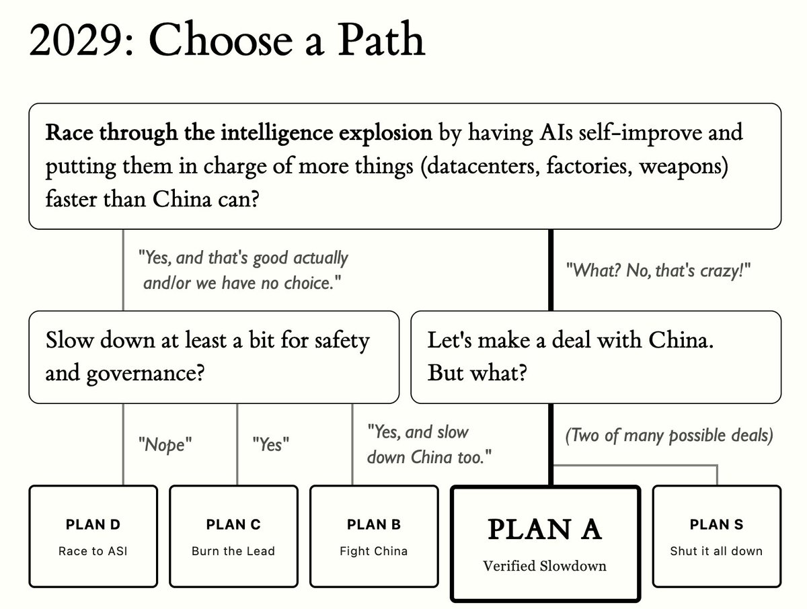

# Response to AI 2040 by 0.005 Seconds (3/694) (@seconds_0)

Archived from [Thread Reader](https://threadreaderapp.com/thread/2075262321266704769.html); [read the root post on X](https://twitter.com/seconds_0/status/2075262321266704769).

## Post 1

Published 2026-07-09T16:54:28.556+00:00 (timestamp decoded from post ID).

it feels nice to pretend, but Plan D is the only actual plan. Plan C is what will probably happen from a fearful post-Trump USG

> <https://twitter.com/AndrewCurran_/status/2075255225179627789>

[Original post](https://x.com/seconds_0/status/2075262321266704769)

## Quoted context

### [Andrew Curran](https://x.com/AndrewCurran_)

Published 2026-07-09T16:26:16.717+00:00 (timestamp decoded from post ID).

> The AI 2027 team has written a new scenario, AI 2040. [pic.twitter.com/wpSt9a27HP](https://t.co/wpSt9a27HP)
>
> — Andrew Curran (@AndrewCurran\_)

[Original quoted post](https://x.com/AndrewCurran_/status/2075255225179627789)
